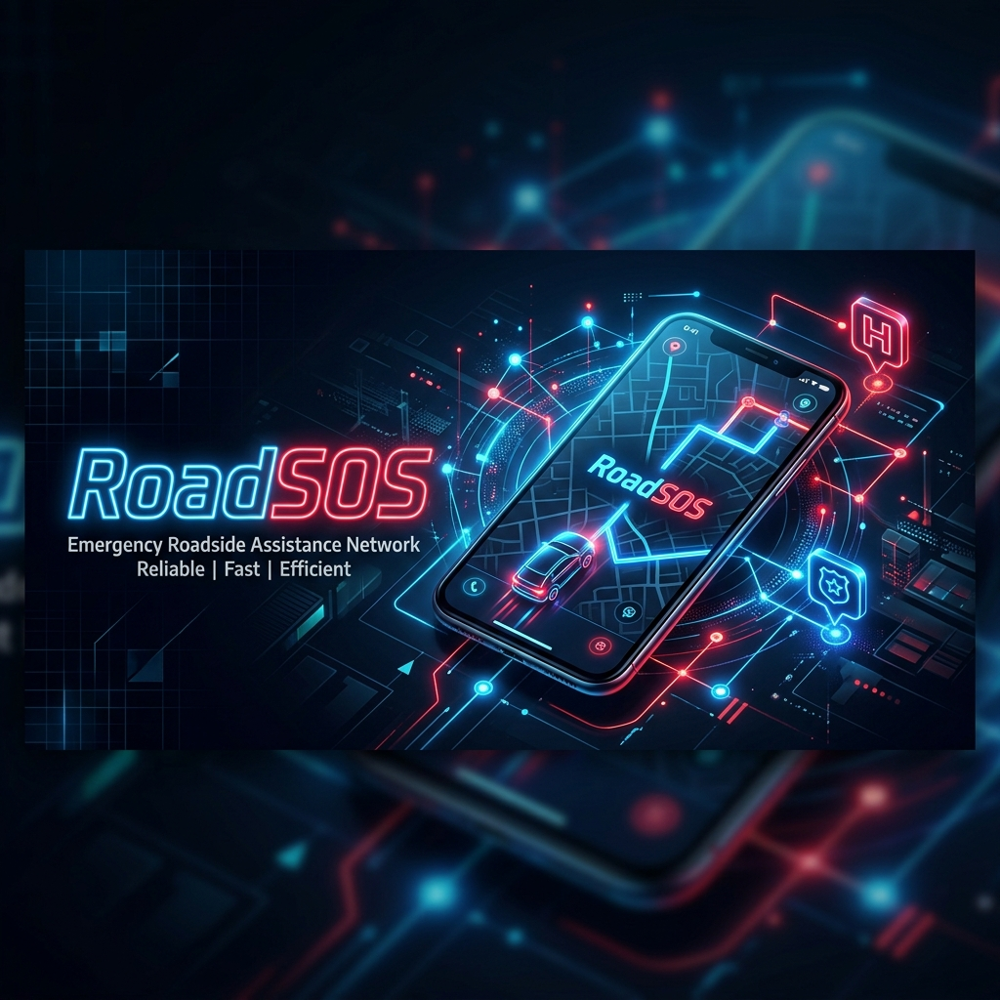
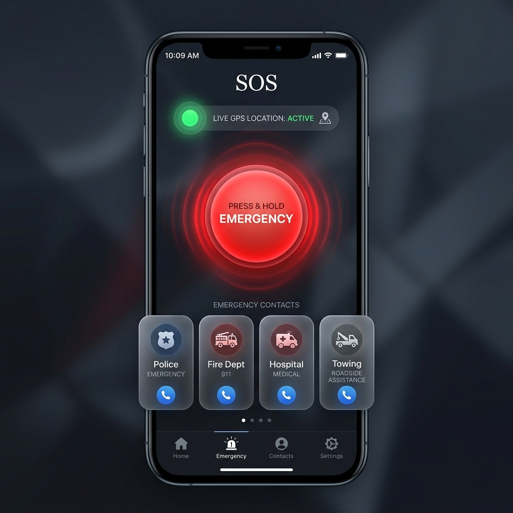
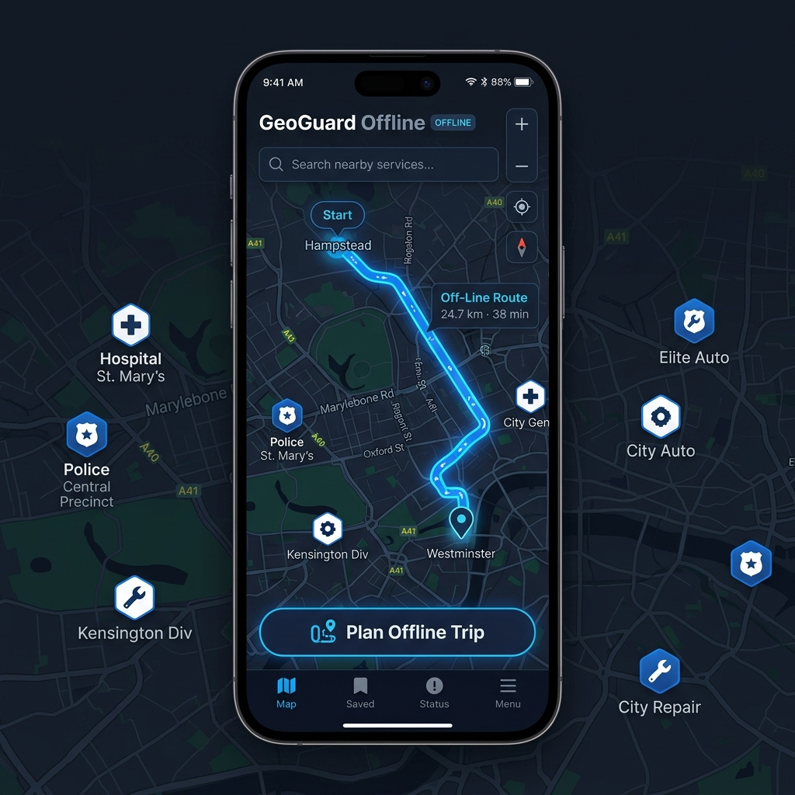
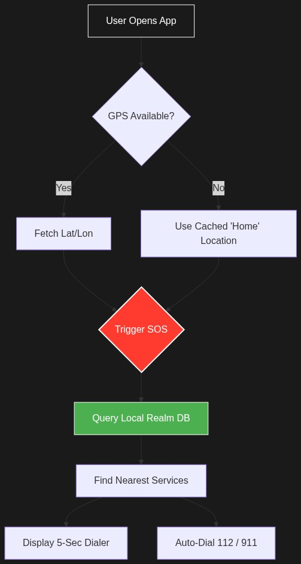
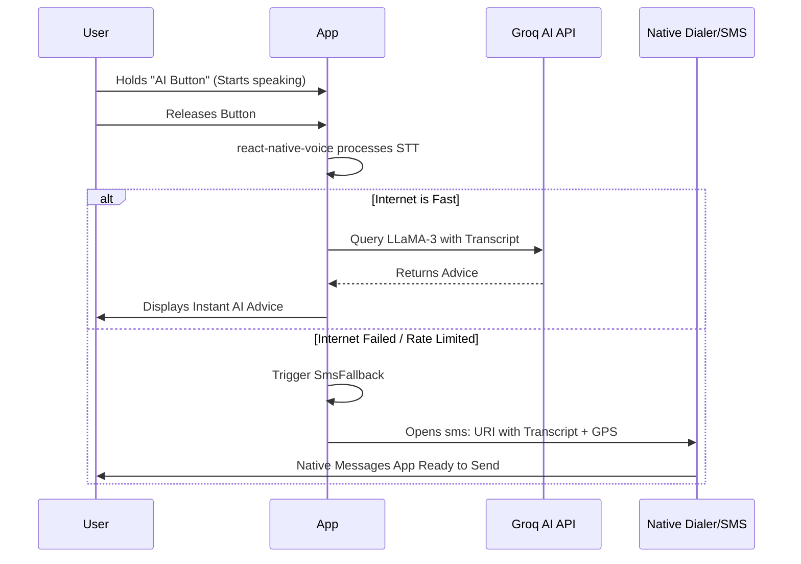

<div align="center">
  

  # RoadSOS 🚑🚗
  
  **Offline-first emergency services & vehicular support in your pocket.**

  [](https://reactnative.dev/)
  [](https://expo.dev/)
  [](https://realm.io/)
  [](LICENSE)
</div>

<br />

RoadSOS is a privacy-focused mobile application built to provide immediate access to emergency services during critical situations—especially when cellular connectivity is unavailable, spotty, or unreliable. 

Built with React Native (Expo SDK 56) and optimized for low-resource environments, RoadSOS uses a highly efficient local caching strategy powered by Realm DB and OpenStreetMap data to ensure that users are never stranded.

---

## 📸 Interactive Preview

<div align="center">
  
  
</div>

---

## 🚀 Key Features

- 📶 **True Offline Capability:** Browse nearby hospitals, police stations, trauma centers, and towing services with zero internet connection via pre-bundled and pre-cached OpenStreetMap data.
- 🗺️ **Smart Trip Corridors:** Plan your road trip and automatically download an offline emergency POI buffer along your exact OSRM-routed corridor before departure.
- ⏱️ **5-Second SOS Dialer:** A built-in panic button that initiates an auto-dial countdown to emergency services. 
- 🎙️ **Voice-Activated AI Assistant:** "Hold for AI" voice button powered by the Groq LLaMA-3 API provides instantaneous, voice-transcribed emergency guidance.
- 📱 **Intelligent Fallbacks:** SMS fallbacks directly trigger your native SMS app to send your exact GPS coordinates to designated emergency contacts if internet API requests fail. 
- 💸 **Rate-Limited API:** Implements strict client-side hard caps (80% free tier margins) on API integrations, ensuring completely $0.00/month running costs.

---

## 🧠 System Architecture

The core philosophy of RoadSOS is **"Zero network calls in the hot path"**. All critical emergency queries hit a local Realm Database first.

<div align="center">
  
</div>

---

## 🎙️ AI Voice Workflow

Our AI processing ensures that if the API is unreachable, the system gracefully degrades to a native SMS intent, ensuring the user is always heard.



---

## 🛠️ Tech Stack

- **Framework:** React Native / Expo (SDK 56, Expo Router)
- **Database:** Realm DB (Local-first, encrypted schema v2)
- **Map Engine:** `react-native-maps` with offline MBTiles support and dynamic OSM fallback 
- **AI Processing:** `@react-native-voice/voice` (STT) + Groq API
- **Background Sync:** `react-native-background-fetch` (24hr periodic sync for 50km home zones)

---

## 📦 Getting Started

### Prerequisites
- Node.js >= 18
- Android Studio / Xcode (for emulation)
- EAS CLI (`npm i -g eas-cli`)

### Installation & Running Locally

```bash
# 1. Clone the repository
git clone https://github.com/yugdave2005/Road-SOS.git
cd Road-SOS/apps/mobile

# 2. Install dependencies
npm install

# 3. (Optional) Run Expo prebuild to generate native directories
npx expo prebuild

# 4. Launch the Metro bundler
npx expo start --dev-client
```

### Building the APK (Android)
Generate an Android APK directly via EAS:
```bash
npx eas build --profile preview --platform android
```

---

## 🔒 Privacy First

RoadSOS does not require user accounts, tracks zero analytics, and performs all primary geofencing and POI queries locally on the device using Realm DB. Your location data never leaves your device unless you explicitly trigger an AI query or SMS fallback.

---

## 📝 License

This project is licensed under the MIT License.
